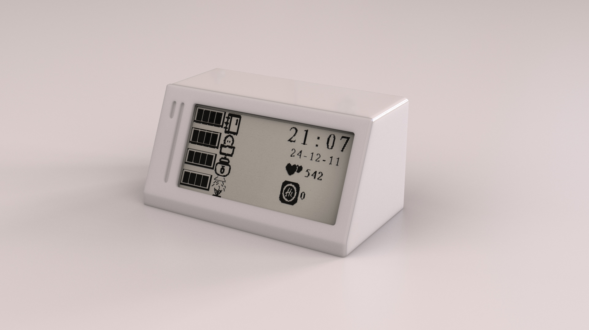
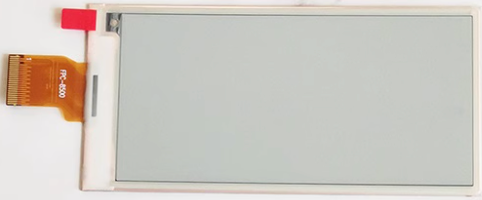
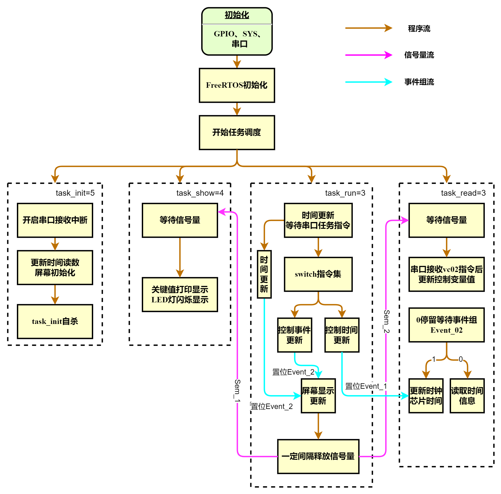
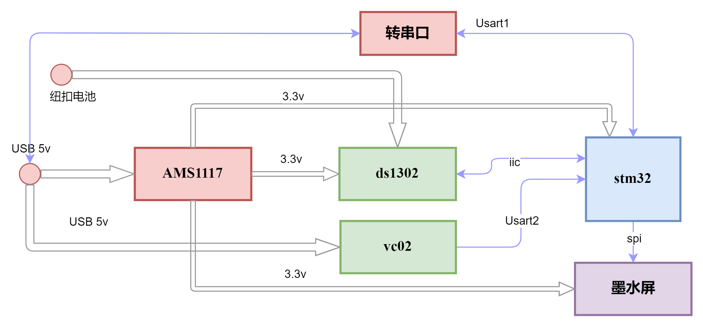
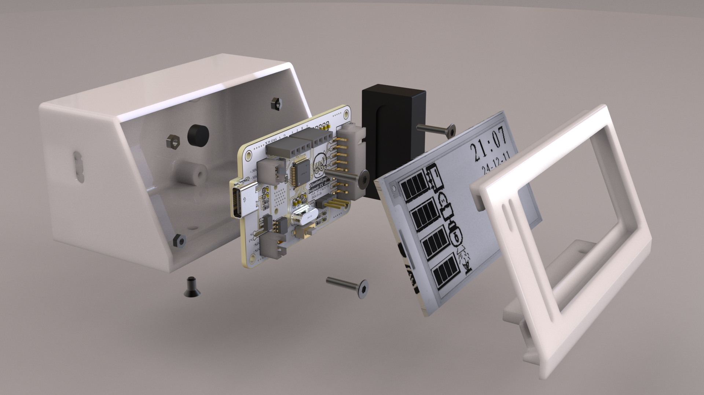
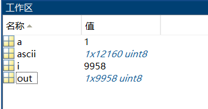
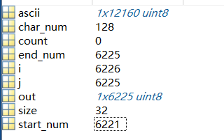

# xiaotian_Epaper

**一款语音控制的墨水屏桌面助手**

**具备时间显示、倒计时事件显示、累积事件显示、语音控制功能**

**一款动动嘴就能交互的极简风桌面摆件！**

**组成：**墨水屏、stm32、vc02语音模块、实时时钟

**使用软件：**cubeide1.16.1、lceda专业版、solidworks2023、keyshot10


**<font color='RedOrange'>完整资料：</font>** **已上传**[Xiaotian_Epaper](https://github.com/Juno-cyber/Xiaotian_Epaper)

**<font color='RedOrange'>更新日志：</font>** 

1. 2024.12.13：首次上传，版本v0.0.1



## 文件结构

| 序号 | 文件名       | 描述          |
| ---- | ------------ | ------------- |
| 1    | Hardware     | 硬件设计      |
| 2    | Firmware     | 固件文件      |
| 3    | Software     | 软件程序      |
| 4    | CAD_Model    | 模型文件      |
| 5    | Docs         | 文档          |
| 6    | Tools        | 附带工具      |
| 7    | img          | 输出图片      |
| 8    | REDME.assets | REDME中的图片 |

## 控制指令

**语音控制指令集**

| 命令词             | 回复语                                                       | 备注   |
| ------------------ | ------------------------------------------------------------ | ------ |
| 请介绍你自己       | 你好我叫小天 我是一个桌面助手<br /> 你可以通过语音和我进行交互<br /> 你可以说浇过花了 浇过水了 更改时间 更换图片<br /> 有什么需要尽管给我说 | 需唤醒 |
| 你好小天\|小天小天 | 随时待命                                                     | 唤醒词 |
| 写完日记了         | 记录每一天                                                   | 免唤醒 |
| 看完书了           | 日拱一卒功不唐捐                                             | 免唤醒 |
| 加过水了           | 下次早点浇                                                   | 免唤醒 |
| 坛子加过水了       | 美味需要时间酝酿                                             | 免唤醒 |
| 吃了海底捞         | 发工资了吗又吃海底捞                                         | 免唤醒 |
| 更改时间           | 想要调整时间你可以说时间年加一或者时间年减一                 | 需唤醒 |
| 时间年加一         |                                                              | 需唤醒 |
| 时间年减一         |                                                              | 需唤醒 |
| 时间月加一         |                                                              | 需唤醒 |
| 时间月减一         |                                                              | 需唤醒 |
| 时间日加一         |                                                              | 需唤醒 |
| 时间日减一         |                                                              | 需唤醒 |
| 时间时加一         |                                                              | 需唤醒 |
| 时间时减一         |                                                              | 需唤醒 |
| 时间分加一         |                                                              | 需唤醒 |
| 时间分减一         |                                                              | 需唤醒 |
| 更换图片           | 已经更换照片                                                 | 免唤醒 |

## 器件选型

**墨水屏[Epaper](https://item.taobao.com/item.htm?abbucket=20&id=520630517588&ns=1&pisk=g_cI30bxHMjQWFIi-HLafGQtyzPSO0OVAaa-o4CFyWFL2AgmVk8kKWk_Vcn_v68HK8ESxWeoLurUV7gocF-2gIun-72v0nRVUCjLESjR2JIzWCUUNydB_d8K-7VJ0N5J3IgnDvrwH6U8WFazzzBK2JeOBrrTJTBK2leTkrSLw7nJ55U7l9C8J6UTWzqOpzF8yl3Tuzsdp_CJ5VEgy7E-IK1_ypaxRFunZPNd6S3Lf_C-9Q2QciEgSPl_cJEYBl1-7faQdo3IT1HfiPhZ1-yNzLVtoAoL5SONpS3semMxqKWgO4HKqRiHjOZZBX082J_RiViE6qUsSMBLlWZQHXeGo10aeAG_TXKlnVu_v-NZQdxUUWiIno2pIhmS5ko-ORIBbukq7XesDh5sq8MmzziBO6nA4D54ckDFFNwcNPZ25F6lESmPtqQUVClupP4B0FT1xT2LSPZ25F6lEJUgRq865MXl.&priceTId=2147bfb017340128577698168e3e44&skuId=3863425440922&spm=a21n57.1.hoverItem.3&utparam=%7B%22aplus_abtest%22%3A%229007f57ddb131b74f319c38ba1bcda2a%22%7D&xxc=taobaoSearch)：**

分辨率296x128像素 、2.9寸、黑白

刷新方式：全屏刷新/局部刷新（4灰阶不支持局刷）

刷新时间：全刷3秒，局刷0.6秒

据说无故障刷新次数为100w次，我设置每分钟刷新一次，那这样算，能够用两年，想想也还有点短



**stm32f103cbt6**

72M主频，基本外设丰富，特别的是128k flash，对于当前所选墨水屏分辨率来说

一张全屏照片大小=296x128/8=4.7k，即使考虑到用上freeRTOS也可以无压力存20来张图像，并且往往无需全屏图像，对于个人开发来说完全够用了

**vc02语音模块**

一款低成本纯离线语音识别模组，**简单说就是写好对答语句，说特定语句执行特定功能**，这里使用时，说出特定语句发送串口指令到主控进行任务控制。支持150条本地指令离线识别，支持RTOS轻量级系统，具有丰富的外围接口，以及简单友好的[客制化工具](http://voice.ai-thinker.com/#/)，该项目放弃了按键交互，完全使用语音模块进行交互，**想干嘛动动嘴就行，君子动口不动手！**

**DS1302**

一款时钟芯片，用于离线时间记录，确保断电后设备仍然能保持时间

## 软件框架

使用cubeide经过初步封装后的freeRTOS，建立了四个任务init、show、run、read，分别执行初始化、显示、主要运行计算、读取任务

为了降低不同任务抢夺共享资源，用了两个无限时间等待的信号量确保run任务正常运行，用了两个事件组分别控制时钟芯片的数据读写和墨水屏的刷新显示




## 模块数据流

列出硬件组成中模块的电气连接及数据流向



## 3D设计及安装

xiaotian结构设计如下，pcb固定采用内嵌螺母设计，在**3D打印时需要注意设置一个暂停层**，把螺母放进去再继续打印；

巧妙地外壳和屏幕壳体设计，使用Bambu的0.12mm打印刚好将屏幕壳体嵌入到外壳中，在底部使用两颗平头螺丝固定，表面外壳看不出什么安装的痕迹，对于审美的一点点强迫症，舒适了！



## 字模压缩

### 游程编码压缩字模大小

考虑到嵌入式设备的flash容量有限，对保存的ASCII字模进行一定压缩处理，大大缩减了字模数组所占存储

取模软件取到的字模如下，在进行存储时，黑色区域存储为0x00，那么字模中就有大片的0x00存在，那么你一定能想到一种简单的思路对字模进行压缩。

如“0000000000”=”10个0“，这个思路叫做**游程编码**，其核心思想是通过减少重复数据的存储来实现压缩。在数据序列中，连续出现的相同元素组成的一段被称为一个“游程”。编码时，每个游程被替换为一个表示游程长度和游程值的二元组。例如，在字符串“AAAABBBCCDAA”中，“AAAA”是一个游程，长度为4，可以表示为(4, 'A')。


**1.num-char压缩方式**

“AAAABBBCCDAA” =》 (4, 'A')(3, 'B')(2, 'C')(1, 'D')(2, 'A')

这种方式的压缩率**大概是81.89%**



**2.只压缩0x00的方式**

“00000AAAABBBCCDAA” =》 (5, 0x00)"AAAABBBCCDAA"

这种方式压缩率达到**51.19%**，**不过对应的编码和解码就麻烦一点**，这里自己写了一个`xiaotian_Epaper\6.Tools\ed_codem.m`文件进行处理，**项目也采用该方式进行字模压缩**



**字模制作过程：**

先在字模工具中制作完成->生成.c文件用vscode打开->正则表达式进行替换，删除不必要的注释内容，替换成可输入到matlab中的形式->拷贝到ed_codem.m文件中进行运算->拷贝到c程序中

**字模数据处理所用正则表达式：**

```
/\*.*?\*/			搜索所有/*  */括起来的内容 
,(?![^,]*,)			选中所有行最后一个逗号
\n{2}				选中连续的两个换行符
```

## 工具使用

**取模软件**

工具路径：`xiaotian_Epaper\6.Tools\CharacterMatrix 3.0.2.3.exe`

**vc02烧录工具**：[教程参考](https://blog.csdn.net/Boantong_/article/details/123846788)

工具路径：`xiaotian_Epaper\6.Tools\hummingbird-m-production-tool\UniOneDownloadTool.exe`

固件路径：`xiaotian_Epaper\2.Firmware\uni_app_release.bin`
